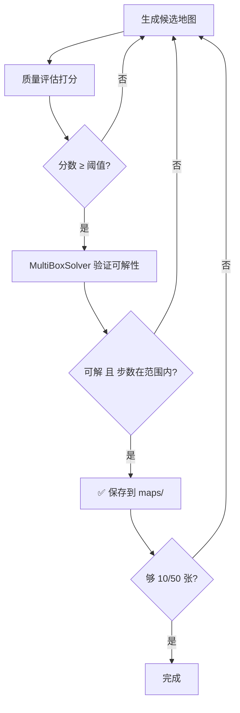

# 高质量推箱子地图批量生成 · 详细实施方案

> **目标**：为 6 个 Phase 各生成 10-50 张高质量、100% 可解的训练地图
> **输出目录**：`maps/phase{1-6}/`
> **地图格式**：12 行 × 16 字符纯文本，字符集 `# - $ . *`
> **车出生位置**：(col=1, row=6) 即左侧中间

---

## 一、现有方案问题诊断

### 1.1 当前地图质量缺陷

````carousel
```
Phase 1 当前地图（空旷无聊）：
################
#--------------#
#--------------#
#--------------#
#--------------#
#--------------#
#---$---.------#   ← 箱子距目标仅 4 格，直线推即过关
#--------------#
#--------------#
#--------------#
#--------------#
################
```
<!-- slide -->
```
Phase 3 当前地图（毫无互挡）：
################
#--------------#
#--------------#
#---$----------#
#----------.---#   ← 两个箱子互不干扰，分别推即可
#--------------#
#---$----------#
#----------.---#
#--------------#
#--------------#
#--------------#
################
```
<!-- slide -->
```
Phase 4 当前地图（无路径规划深度）：
################
#--------------#
#--$---$---$---#   ← 三个箱子对称排列
#--------------#
#--------------#      全是空地，直线向下推
#--------------#
#--------------#
#--------------#
#--------------#
#--.---.---.---#   ← 一步到位，毫无挑战
#--------------#
################
```
````

**核心问题**：
1. **地图全是空地**，无内墙结构 → 推箱子没有任何路径思考
2. **箱子和目标距离太近**，常常直线推 2-5 步就过关
3. **多箱场景无互挡关系** → 可以独立解决每个箱子
4. **没有死锁陷阱** → 训练出的模型不会学到"避免死角"
5. **Phase 5/6 的 TNT 毫无必要性** → 不用炸弹也能通关

### 1.2 高质量地图应该长什么样

```
一个合格的 Phase 3 地图示例：
################
#-#---#--#-----#
#---#--#-------#
##-###-#-#-----#
#-.#-#-#-------#   ← 内墙创造迷宫结构
#-##-----------#   ← 箱子路径被墙壁限制
#--#-------##--#
#----------$---#   ← 箱子需要绕路才能到目标
#--$-#---------#   ← 两个箱子路径在走廊交叉
#----########--#     推 A 会堵住 B 的必经之路
#----#.-.------#   ← 目标在狭窄区域，需要精确入位
################
```

---

## 二、生成策略总体架构

采用 PDF 中**两种最核心的可落地方法**，根据 Phase 特性选择：

| Phase | 策略 | 原理 |
|-------|------|------|
| P1-P4 | **逆向拉动法** (Reverse Play) | 从已解决状态出发，反向拉箱子 → 数学保证可解 |
| P5-P6 | **前向构造 + 求解器验证** | 先构造含 TNT 的地图，再用 MultiBoxSolver 验证 |

### 2.1 总体流水线



---

## 三、Phase 1：1 箱无墙 · 长距离路径规划

### 3.1 设计目标

- 无内墙，但箱子距目标的**曼哈顿距离 ≥ 12**
- 需要至少 **2 次转弯**（不能是纯直线推送）
- 解路径步数 **15-40 步**

### 3.2 生成算法：逆向拉动 + 距离最大化

```python
def generate_phase1():
    """Phase 1: 无墙单箱，逆向生成保证可解"""
    
    # 1. 初始化空白网格（只有外围墙）
    grid = 创建 12×16 网格，四周为 #，内部为 -
    
    # 2. 随机放置目标位置（避开外围 2 格缓冲区）
    target = 随机选择内部位置 (col ∈ [3,12], row ∈ [3,8])
    
    # 3. 将箱子放在目标上 → "已解决状态"
    box = target  # 初始状态：箱子 = 目标
    
    # 4. 将车放在箱子的随机正交邻居空地上
    car = 箱子的随机相邻位置
    
    # 5. 逆向拉动 N 步（N ∈ [20, 50]）
    for step in range(random.randint(20, 50)):
        # 枚举合法的拉动方向
        valid_pulls = []
        for dx, dy in [(1,0),(-1,0),(0,1),(0,-1)]:
            # 车后退一步的位置
            car_retreat = (car[0] - dx, car[1] - dy)
            # 车必须在箱子的相邻位置（与拉动方向一致）
            car_at_box_side = (box[0] + dx, box[1] + dy)
            
            if car == car_at_box_side:
                # 车在箱子的 (dx,dy) 方向侧
                # 车后退: car → car - (dx,dy)
                # 箱子被拉: box → box + (dx,dy)
                new_car = (car[0] - dx, car[1] - dy)
                new_box = (box[0] + dx, box[1] + dy)
                
                if 位置合法(new_car) and 位置合法(new_box):
                    # 计算拉动后箱子到target的距离
                    dist = manhattan(new_box, target)
                    valid_pulls.append((new_car, new_box, dist, (dx,dy)))
        
        if not valid_pulls:
            # 车自由移动到箱子的另一侧，然后继续
            car = 随机移动车到箱子的另一个相邻位置
            continue
        
        # 6. 距离最大化偏置选择
        # 80% 概率选择使箱子远离目标的方向
        # 20% 概率随机选（避免总是直线远离）
        if random() < 0.8:
            选择 dist 最大的 pull
        else:
            随机选择
        
        car, box = new_car, new_box
    
    # 7. 质量过滤
    final_dist = manhattan(box, target)
    if final_dist < 12:
        return None  # 距离太近，丢弃
    
    # 8. 用 bfs_push 计算实际解路径
    solution = bfs_push(car, box, target, grid)
    if solution is None:
        return None  # 不应发生，但做保险
    
    # 9. 统计转弯次数
    turns = count_direction_changes(solution)
    if turns < 2:
        return None  # 太直线
    
    # 10. 写入地图
    return grid_to_string(grid, [box], [target], [])
```

### 3.3 质量指标

| 指标 | 最低阈值 | 说明 |
|------|---------|------|
| 曼哈顿距离 | ≥ 12 | 箱子到目标的直线网格距离 |
| 解路径步数 | 15-40 | 太短无聊、太长求解慢 |
| 方向变化次数 | ≥ 2 | 不是纯直线推 |

---

## 四、Phase 2：1 箱有墙 · 迷宫绕路

### 4.1 设计目标

- 内墙占内部面积 **15-25%**，形成有意义的走廊和拐角
- 解路径**转弯 ≥ 4 次**
- 解路径步数 **20-60 步**

### 4.2 生成算法：迷宫构建 + 逆向拉动

```python
def generate_phase2():
    """Phase 2: 有墙单箱，迷宫 + 逆向生成"""
    
    # 1. 生成迷宫拓扑骨架
    grid = create_maze_grid()  # 见下方子算法
    
    # 2. 确保连通性
    if not is_connected(grid):
        return None
    
    # 3. 在迷宫中随机选择目标位置
    open_cells = 获取所有空地位置
    target = 从 open_cells 中选一个不在死角的位置
    
    # 4. 箱子初始放在目标上
    box = target
    
    # 5. 车放在箱子邻居
    car = 箱子的随机可达相邻空地
    
    # 6. 在迷宫中执行逆向拉动 30-80 步
    # 墙壁自然限制拉动方向，迫使产生弯曲路径
    for step in range(random.randint(30, 80)):
        执行逆向拉动（同 Phase 1 逻辑）
        # 但这里墙壁会阻止某些方向
        # 如果车到不了箱子的某一侧，就跳过该方向
    
    # 7. 质量评估
    solution = bfs_push(car, box, target, grid)
    if solution is None:
        return None
    
    turns = count_direction_changes(solution)
    steps = len(solution)
    
    if turns < 4 or steps < 20:
        return None  # 不够曲折
    
    return grid_to_string(grid, [box], [target], [])


def create_maze_grid():
    """使用随机 DFS 生成迷宫，然后打通一些墙壁增加通路"""
    
    # 1. 初始化全墙内部
    grid = 12×16 网格
    外围为 #
    内部初始全为 #（2-9 行, 1-14 列）
    
    # 2. 随机 DFS 挖洞生成迷宫
    # 起点: 随机奇数坐标
    # 每次向随机方向探索 2 格（打通中间的墙）
    stack = [起点]
    visited = {起点}
    grid[起点] = 0  # 打通
    
    while stack:
        current = stack[-1]
        neighbors = 未访问的距离为2的邻居
        if neighbors:
            next = random.choice(neighbors)
            打通 current 和 next 之间的墙
            visited.add(next)
            stack.append(next)
        else:
            stack.pop()
    
    # 3. 额外打通 15-30% 的随机墙壁，避免迷宫过于封闭
    # （推箱子需要比经典迷宫更宽的走廊）
    walls_to_remove = 随机选择 15-30% 的内墙
    for wall in walls_to_remove:
        grid[wall] = 0
        if not is_connected(grid):
            grid[wall] = 1  # 恢复
    
    # 4. 确保 (1, 6) 即车出生点是空地
    grid[6][1] = 0
    
    return grid
```

### 4.3 质量指标

| 指标 | 最低阈值 |
|------|---------|
| 内墙比例 | 15-25% |
| 转弯次数 | ≥ 4 |
| 解路径步数 | 20-60 |
| 连通性 | 所有空地连通 |

---

## 五、Phase 3：2 箱有墙 · 路径冲突与推送顺序

### 5.1 设计目标

- 2 个箱子的解路径**必须在某处交叉/冲突**
- 推箱子存在**顺序依赖**：先推 A 会堵住 B 的路，必须先推 B
- 解路径步数 **30-80 步**

### 5.2 生成算法：多箱交替逆向拉动

```python
def generate_phase3():
    """Phase 3: 双箱，路径冲突"""
    
    # 1. 生成迷宫（同 Phase 2，但墙壁密度稍高 20-30%）
    grid = create_maze_grid(wall_density=0.25)
    
    # 2. 放置 2 个目标点
    # 关键：目标点应该相对靠近（距离 3-6 格）
    # 这样两个箱子的路径更容易发生冲突
    open_cells = 获取所有非死角空地
    target1 = 随机选择
    target2 = 从距离 target1 为 3-6 格的空地中选择
    
    # 3. 两箱初始都在目标上
    box1, box2 = target1, target2
    
    # 4. 车放在 box1 邻居
    car = box1 的随机可达相邻空地
    
    # 5. 多智能体交替逆向拉动
    for step in range(random.randint(30, 60)):
        # 随机选择拉哪个箱子
        # 但优先拉距离目标更近的那个（增加路径交叉机会）
        target_box = random.choice([0, 1])
        
        执行逆向拉动 box[target_box]
        # 注意: 另一个箱子的位置也是障碍物
        # 车需要 BFS 绕过另一个箱子才能到达目标箱子的推位
    
    # 6. 验证路径冲突
    # 分别计算两个箱子的独立最优路径
    path1 = bfs_push(car, box1, target1, grid, obstacles={box2})
    path2 = bfs_push(车在box1到达后的位置, box2, target2, grid)
    
    # 检查路径是否经过对方的关键位置
    path1_cells = set(沿路径经过的箱子位置)
    path2_cells = set(沿路径经过的箱子位置)
    overlap = path1_cells & path2_cells
    
    if len(overlap) == 0:
        return None  # 无路径冲突，丢弃
    
    # 7. 用 MultiBoxSolver 完整验证
    solver = MultiBoxSolver(grid, car, 
                            [((box1), 0), ((box2), 1)],
                            {0: target1, 1: target2}, [])
    solution = solver.solve(time_limit=30)
    if solution is None:
        return None
    
    steps = sum(wc + 1 for _, _, _, wc in solution)
    if steps < 30:
        return None  # 太短
    
    return grid_to_string(grid, [box1, box2], [target1, target2], [])
```

### 5.3 质量指标

| 指标 | 最低阈值 |
|------|---------|
| 路径重叠格数 | ≥ 1（两箱路径必须交叉） |
| 解路径总步数 | 30-80 |
| 内墙比例 | 20-30% |
| 目标间距离 | 3-6 格 |

---

## 六、Phase 4：3 箱复杂墙 · 全局规划

### 6.1 设计目标

- 地图分为 **2-3 个区域**，由 **1-2 格宽的通道** 连接
- 箱子和目标分布在不同区域
- 解路径需要**穿越至少 2 个区域边界**
- 解路径步数 **40-120 步**

### 6.2 生成算法：BSP 房间分割 + 逆向拉动

```python
def generate_phase4():
    """Phase 4: 三箱，多房间结构"""
    
    # 1. BSP 空间分割生成房间
    grid = create_bsp_rooms()
    
    # 2. 在不同房间放置 3 个目标
    rooms = identify_rooms(grid)  # 连通区域分析
    if len(rooms) < 2:
        return None
    
    # 目标集中在一个房间（"目标室"）
    goal_room = random.choice(rooms)
    targets = 在 goal_room 中选 3 个非死角位置
    
    # 3. 箱子初始在目标上
    boxes = targets[:]
    
    # 4. 逆向拉动，强制跨越房间边界
    for i in range(3):
        # 将箱子 i 拉到与目标室不同的房间中
        while box_in_same_room_as_target(boxes[i], goal_room):
            执行逆向拉动 boxes[i]
    
    # 5. 用 MultiBoxSolver 验证
    solver = MultiBoxSolver(...)
    solution = solver.solve(time_limit=60)
    if solution is None:
        return None
    
    steps = sum(wc + 1 for _, _, _, wc in solution)
    if steps < 40:
        return None
    
    return grid_to_string(...)


def create_bsp_rooms():
    """BSP 二叉空间分割"""
    
    # 1. 16×12 的内部空间 (去掉外围墙后 14×10)
    # 初始全为空地
    
    # 2. 递归分割
    # 随机选择水平或垂直方向
    # 在当前区域的中间 40-60% 位置放一排墙
    # 在墙上开 1-2 格的门
    
    # 3. 递归深度 1-2 层（14×10 太小，不要分太碎）
    
    # 示例结构:
    # ################
    # #------##------#     ← 垂直分割，中间留门
    # #------##------#
    # #------##------#
    # #-------#------#     ← 门
    # #------##------#
    # ####--##########     ← 水平分割
    # #--------------#
    # #--------------#
    # #--------------#
    # #--------------#
    # ################
    
    # 4. 在每个子区域内添加少量随机墙壁增加复杂度
    
    return grid
```

### 6.3 质量指标

| 指标 | 最低阈值 |
|------|---------|
| 房间数量 | 2-3 |
| 门宽度 | 1-2 格 |
| 解跨越门的次数 | ≥ 2 |
| 解路径总步数 | 40-120 |

---

## 七、Phase 5：3 箱 + TNT · 炸弹必须使用

### 7.1 设计目标

- 不使用炸弹**不可能通关**（关键路径被墙封死）
- 使用炸弹后路径打通
- 解路径步数 **50-150 步**

### 7.2 生成算法：前向构造 + 双重验证

> [!IMPORTANT]
> Phase 5 **不使用逆向拉动法**，因为炸弹逻辑在时间逆转中无法合理还原。
> 改用"构造性前向生成 + 求解器验证"。

```python
def generate_phase5():
    """Phase 5: 前向构造，爆破必须"""
    
    # 策略 A: 基于 Phase 4 地图改造
    
    # 1. 先生成一个 Phase 4 的合格地图
    base_map = generate_phase4()  # 已知可解
    grid, boxes, targets = parse(base_map)
    
    # 2. 找到解路径的关键必经通道
    solution = solver.solve(grid, boxes, targets)
    path_cells = extract_path_cells(solution)
    
    # 找到路径经过的门/窄道
    bottlenecks = find_bottlenecks(path_cells, grid)
    
    # 3. 封堵一个关键通道
    # 在瓶颈处放 2-3 格墙壁，彻底堵死
    for cell in bottlenecks[0]:
        grid[cell] = WALL
    
    # 4. 验证封堵后确实不可解（无炸弹时）
    solver_no_bomb = MultiBoxSolver(grid, car, boxes, targets, bombs=[])
    if solver_no_bomb.solve(time_limit=10) is not None:
        return None  # 没堵住，丢弃
    
    # 5. 在远离瓶颈的位置放置 1 个 TNT
    tnt_pos = 在距离瓶颈 ≥ 5 格的空地中随机选择
    
    # 6. 验证有炸弹时可解
    solver_with_bomb = MultiBoxSolver(grid, car, boxes, targets, bombs=[tnt_pos])
    solution = solver_with_bomb.solve(time_limit=60)
    if solution is None:
        return None  # 即使有炸弹也解不了
    
    # 7. 验证解中确实使用了炸弹
    used_bomb = any(etype == 'bomb' for etype, _, _, _ in solution)
    if not used_bomb:
        return None  # 炸弹没用到
    
    return grid_to_string(grid, boxes, targets, [tnt_pos])
```

### 7.3 质量指标

| 指标 | 要求 |
|------|------|
| 无炸弹时 | **不可解**（必须证明死锁） |
| 有炸弹时 | **可解**（求解器找到解） |
| 解中是否使用炸弹 | **必须使用** |
| 总步数 | 50-150 |

---

## 八、Phase 6：混合高难 · 紧凑 + 多机制耦合

### 8.1 设计目标

- 地图空间紧凑（空地 ≤ 50 格，即填充率 ≥ 60%）
- 1-3 箱 + 0-1 TNT 的随机组合
- 解路径步数 **30-150 步**
- 如果有 TNT，必须使用

### 8.2 生成算法：混合策略

```python
def generate_phase6():
    """Phase 6: 混合高难"""
    
    # 随机决定配置
    n_boxes = random.randint(1, 3)
    has_tnt = random.choice([True, False])
    
    if has_tnt and n_boxes >= 2:
        # 使用 Phase 5 策略（前向构造 + 验证）
        map = generate_phase5_variant(n_boxes)
    elif n_boxes == 1:
        # 使用 Phase 2 策略但更紧凑
        map = generate_phase2_compact()
    else:
        # 使用 Phase 3/4 策略但更紧凑
        map = generate_phase3_or_4_compact(n_boxes)
    
    # 额外的紧凑度验证
    open_count = count_open_cells(map)
    if open_count > 50:
        return None  # 不够紧凑
    
    return map
```

### 8.3 质量指标

| 指标 | 要求 |
|------|------|
| 空地格数 | ≤ 50（14×10=140 格内部空间中） |
| 解步数 | 30-150 |
| TNT 使用 | 有 TNT 时必须使用 |

---

## 九、核心子算法实现规格

### 9.1 逆向拉动引擎（Phase 1-4 共用）

```python
class ReversePullEngine:
    """逆向拉动引擎 - 从胜利状态出发生成初始状态"""
    
    def __init__(self, grid, targets, n_boxes):
        self.grid = grid  # 2D list, 1=墙 0=空
        self.targets = targets
        self.n_boxes = n_boxes
    
    def generate(self, min_steps=20, max_steps=80,
                 distance_bias=0.8) -> Optional[dict]:
        """
        执行逆向拉动生成。
        
        Args:
            min_steps: 最少拉动步数
            max_steps: 最多拉动步数
            distance_bias: 选择使箱子远离目标方向的概率
        
        Returns:
            {
                'car': (col, row),
                'boxes': [(col, row), ...],
                'targets': [(col, row), ...],
                'pull_count': int,
            }
            或 None（生成失败）
        """
        
        # 初始化：所有箱子在目标上
        boxes = list(self.targets)
        car = self._random_adjacent(boxes[0])
        
        steps = random.randint(min_steps, max_steps)
        actual_pulls = 0
        
        for _ in range(steps * 3):  # 允许失败重试
            if actual_pulls >= steps:
                break
            
            # 选择拉哪个箱子
            box_idx = random.randint(0, self.n_boxes - 1)
            box = boxes[box_idx]
            target = self.targets[box_idx]
            
            # 枚举合法拉动
            pulls = self._enum_pulls(car, box, boxes)
            if not pulls:
                # 车自由移动到另一个箱子旁边
                car = self._walk_to_random_box_side(car, boxes)
                continue
            
            # 偏置选择
            if random.random() < distance_bias:
                # 选择使箱子远离目标的拉动
                pulls.sort(key=lambda p: -manhattan(p['new_box'], target))
                choice = pulls[0]
            else:
                choice = random.choice(pulls)
            
            car = choice['new_car']
            boxes[box_idx] = choice['new_box']
            actual_pulls += 1
        
        return {'car': car, 'boxes': boxes, 
                'targets': list(self.targets), 'pull_count': actual_pulls}
    
    def _enum_pulls(self, car, box, all_boxes):
        """枚举当前箱子的所有合法拉动"""
        results = []
        obstacles = set(b for b in all_boxes if b != box)
        
        for dx, dy in [(1,0),(-1,0),(0,1),(0,-1)]:
            # 要拉箱子向 (dx,dy) 方向移动：
            # 1. 车必须在箱子的 (dx,dy) 方向 → car == (box + d)
            # 2. 车后退到 (car + d) → new_car
            # 3. 箱子移到 (box + d) → new_box = car 的原位置
            
            required_car_pos = (box[0] + dx, box[1] + dy)
            new_car = (car[0] + dx, car[1] + dy) if car == required_car_pos else None
            
            # 其实：拉动 = 车在箱子的某一侧，车和箱子同时向那一侧移动
            # 车从 (box_c + dx, box_r + dy) 移到 (box_c + 2*dx, box_r + 2*dy)
            # 箱子从 (box_c, box_r) 移到 (box_c + dx, box_r + dy)
            
            car_must_be = (box[0] + dx, box[1] + dy)
            new_car_pos = (box[0] + 2*dx, box[1] + 2*dy)
            new_box_pos = (box[0] + dx, box[1] + dy)
            
            if car != car_must_be:
                # 车不在正确位置，检查能否走过去
                if self._can_reach(car, car_must_be, obstacles | {box}):
                    # 可以走过去，但需要先走过去
                    pass  # 这个拉动需要车先移动
                continue
            
            # 检查 new_car_pos 和 new_box_pos 是否合法
            if not self._is_open(new_car_pos, obstacles):
                continue
            # new_box_pos 就是 car 的当前位置，一定是空的
            
            results.append({
                'new_car': new_car_pos,
                'new_box': new_box_pos,
                'direction': (dx, dy),
            })
        
        return results
    
    def _can_reach(self, start, goal, obstacles):
        """BFS 检查车能否到达目标位置"""
        # 标准 BFS，避开墙壁和障碍物
        ...
    
    def _walk_to_random_box_side(self, car, boxes):
        """车自由移动到某个箱子的随机可达邻居"""
        for box in random.sample(boxes, len(boxes)):
            for dx, dy in random.sample([(1,0),(-1,0),(0,1),(0,-1)], 4):
                side = (box[0] + dx, box[1] + dy)
                if self._is_open(side, set(boxes)) and self._can_reach(car, side, set(boxes)):
                    return side
        return car  # 无法移动
```

### 9.2 迷宫生成器

```python
def create_maze_grid(rows=12, cols=16, openness=0.3):
    """
    生成带走廊结构的迷宫网格。
    
    Args:
        rows, cols: 网格尺寸
        openness: 额外打通的墙壁比例 (0-1)
                  0 = 标准迷宫（非常封闭）
                  1 = 几乎全空
    
    Returns:
        2D list, 1=墙 0=空
    """
    grid = [[1]*cols for _ in range(rows)]
    
    # 外围保持为墙
    # 在内部 (1..rows-2, 1..cols-2) 区域用 DFS 生成迷宫
    
    # DFS 迷宫使用 2 格步长
    start = (2, 2)  # 起始挖洞点
    grid[start[1]][start[0]] = 0
    
    stack = [start]
    visited = {start}
    
    while stack:
        cx, cy = stack[-1]
        neighbors = []
        for dx, dy in [(2,0),(-2,0),(0,2),(0,-2)]:
            nx, ny = cx+dx, cy+dy
            if 1 <= nx <= cols-2 and 1 <= ny <= rows-2:
                if (nx, ny) not in visited:
                    neighbors.append((nx, ny, cx+dx//2, cy+dy//2))
        
        if neighbors:
            nx, ny, mx, my = random.choice(neighbors)
            grid[ny][nx] = 0
            grid[my][mx] = 0  # 打通中间的墙
            visited.add((nx, ny))
            stack.append((nx, ny))
        else:
            stack.pop()
    
    # 额外打通
    inner_walls = [(c, r) for r in range(1, rows-1) 
                   for c in range(1, cols-1) if grid[r][c] == 1]
    random.shuffle(inner_walls)
    n_remove = int(len(inner_walls) * openness)
    
    for c, r in inner_walls[:n_remove]:
        grid[r][c] = 0
    
    # 确保 (1, 6) 是空地（车出生点）
    grid[6][1] = 0
    
    # 确保连通
    if not is_all_connected(grid):
        return None  # 重试
    
    return grid
```

### 9.3 BSP 房间分割器

```python
def create_bsp_rooms(rows=12, cols=16, min_room_size=4):
    """
    BSP 二叉空间分割生成多房间结构。
    
    Returns:
        grid: 2D list
        rooms: list of (x1, y1, x2, y2) 房间边界
    """
    grid = [[0]*cols for _ in range(rows)]
    
    # 外围墙
    for c in range(cols):
        grid[0][c] = grid[rows-1][c] = 1
    for r in range(rows):
        grid[r][0] = grid[r][cols-1] = 1
    
    rooms = []
    
    def split(x1, y1, x2, y2, depth=0):
        """递归分割"""
        w = x2 - x1
        h = y2 - y1
        
        if depth >= 2 or (w < min_room_size * 2 and h < min_room_size * 2):
            rooms.append((x1, y1, x2, y2))
            return
        
        # 选择分割方向（优先分割较长的维度）
        if w > h * 1.5:
            direction = 'vertical'
        elif h > w * 1.5:
            direction = 'horizontal'
        else:
            direction = random.choice(['vertical', 'horizontal'])
        
        if direction == 'vertical':
            # 在 x1+min 到 x2-min 之间选分割线
            split_x = random.randint(x1 + min_room_size, x2 - min_room_size)
            
            # 画垂直墙
            for r in range(y1, y2 + 1):
                grid[r][split_x] = 1
            
            # 开 1-2 个门
            door_y = random.randint(y1 + 1, y2 - 1)
            grid[door_y][split_x] = 0
            if random.random() < 0.3:  # 30% 概率开第二个门
                door_y2 = random.randint(y1 + 1, y2 - 1)
                grid[door_y2][split_x] = 0
            
            split(x1, y1, split_x - 1, y2, depth + 1)
            split(split_x + 1, y1, x2, y2, depth + 1)
        
        else:  # horizontal
            split_y = random.randint(y1 + min_room_size, y2 - min_room_size)
            for c in range(x1, x2 + 1):
                grid[split_y][c] = 1
            door_x = random.randint(x1 + 1, x2 - 1)
            grid[split_y][door_x] = 0
            
            split(x1, y1, x2, split_y - 1, depth + 1)
            split(x1, split_y + 1, x2, y2, depth + 1)
    
    split(1, 1, cols - 2, rows - 2)
    
    # 在每个房间内添加少量随机内墙（3-5 个）
    for x1, y1, x2, y2 in rooms:
        n_walls = random.randint(2, 5)
        for _ in range(n_walls):
            wx = random.randint(x1 + 1, x2 - 1)
            wy = random.randint(y1 + 1, y2 - 1)
            grid[wy][wx] = 1
    
    # 确保 (1, 6) 是空地
    grid[6][1] = 0
    
    return grid, rooms
```

### 9.4 质量评估器

```python
class MapQualityEvaluator:
    """地图质量评估器"""
    
    def evaluate(self, grid, car, boxes, targets, bombs, solution):
        """
        综合评估地图质量，返回 0-100 分。
        
        Args:
            solution: MultiBoxSolver 返回的解序列
        """
        scores = {}
        
        # 1. 步数得分（越多越好，但有上限）
        steps = sum(wc + 1 for _, _, _, wc in solution)
        scores['steps'] = min(steps / 80, 1.0) * 25  # 0-25 分
        
        # 2. 转弯得分
        actions = solver.solution_to_actions(solution)
        turns = self._count_turns(actions)
        scores['turns'] = min(turns / 8, 1.0) * 20  # 0-20 分
        
        # 3. 内墙复杂度
        wall_count = sum(1 for r in range(1, 11) for c in range(1, 15)
                        if grid[r][c] == 1)
        wall_ratio = wall_count / 140  # 内部总格数
        scores['walls'] = min(wall_ratio / 0.3, 1.0) * 15  # 0-15 分
        
        # 4. 箱子变轨数（多箱时：切换推不同箱子的次数）
        box_changes = self._count_box_changes(solution)
        scores['box_changes'] = min(box_changes / 4, 1.0) * 20  # 0-20 分
        
        # 5. 紧凑度（空地越少越好）
        open_count = sum(1 for r in range(1, 11) for c in range(1, 15)
                        if grid[r][c] == 0)
        compactness = 1.0 - (open_count / 140)
        scores['compact'] = compactness * 20  # 0-20 分
        
        total = sum(scores.values())
        return total, scores
    
    def _count_turns(self, actions):
        """统计方向变化次数"""
        turns = 0
        for i in range(1, len(actions)):
            if actions[i] != actions[i-1]:
                turns += 1
        return turns
    
    def _count_box_changes(self, solution):
        """统计切换推不同箱子的次数"""
        changes = 0
        prev_eid = None
        for etype, eid, _, _ in solution:
            if etype == 'box' and eid != prev_eid:
                if prev_eid is not None:
                    changes += 1
                prev_eid = eid
        return changes
```

---

## 十、主生成脚本结构

> [!IMPORTANT]
> 以下是最终脚本 `gen_quality_maps.py` 的结构规格。

```python
"""
高质量推箱子地图生成器
========================
用法: python gen_quality_maps.py [--phase N] [--count M]

默认: 每 phase 生成 10 张
"""

import os, sys, random, time, argparse
from typing import *

ROOT = os.path.dirname(os.path.abspath(__file__))
sys.path.insert(0, ROOT)

# ── 导入项目模块（用于验证）──
from solver.multi_box_solver import MultiBoxSolver
from solver.push_solver import bfs_push

# ── 常量 ──
ROWS, COLS = 12, 16
WALL, AIR, BOX, TARGET, BOMB = '#', '-', '$', '.', '*'
CAR_SPAWN = (1, 6)  # 车出生点: col=1, row=6

# ── 子模块 ──
# class ReversePullEngine: ...
# def create_maze_grid(...): ...
# def create_bsp_rooms(...): ...
# class MapQualityEvaluator: ...
# 各 Phase 的 generate_phaseN() 函数

def main():
    parser = argparse.ArgumentParser()
    parser.add_argument('--phase', type=int, choices=[1,2,3,4,5,6],
                       help='只生成特定 phase')
    parser.add_argument('--count', type=int, default=10,
                       help='每 phase 生成数量')
    args = parser.parse_args()
    
    phases = [args.phase] if args.phase else [1,2,3,4,5,6]
    generators = {
        1: generate_phase1,
        2: generate_phase2,
        3: generate_phase3,
        4: generate_phase4,
        5: generate_phase5,
        6: generate_phase6,
    }
    
    for phase in phases:
        print(f"\n{'='*60}")
        print(f"  Phase {phase}: 生成 {args.count} 张地图")
        print(f"{'='*60}")
        
        out_dir = os.path.join(ROOT, 'maps', f'phase{phase}')
        os.makedirs(out_dir, exist_ok=True)
        
        # 清空旧文件
        for f in os.listdir(out_dir):
            os.remove(os.path.join(out_dir, f))
        
        generator = generators[phase]
        saved = 0
        attempts = 0
        start_time = time.time()
        
        while saved < args.count and attempts < args.count * 200:
            attempts += 1
            result = generator()
            if result is None:
                continue
            
            # 保存
            saved += 1
            path = os.path.join(out_dir, f'phase{phase}_{saved:02d}.txt')
            with open(path, 'w', encoding='utf-8', newline='\n') as f:
                f.write(result)
            
            elapsed = time.time() - start_time
            print(f"  [{saved}/{args.count}] 保存 {os.path.basename(path)} "
                  f"(尝试 {attempts} 次, 耗时 {elapsed:.1f}s)")
        
        elapsed = time.time() - start_time
        print(f"  ✅ Phase {phase} 完成: {saved}/{args.count}, "
              f"总尝试 {attempts}, 总耗时 {elapsed:.1f}s")

if __name__ == '__main__':
    main()
```

---

## 十一、预估资源需求

| Phase | 单次生成 | 单次验证 | 合格率 | 10 张预估时间 |
|-------|---------|---------|--------|-------------|
| P1 | <1ms | <10ms | ~30% | <5 秒 |
| P2 | ~5ms | ~50ms | ~15% | <30 秒 |
| P3 | ~10ms | ~500ms | ~10% | <2 分钟 |
| P4 | ~20ms | ~5s | ~5% | <10 分钟 |
| P5 | ~50ms | ~30s (×2) | ~3% | <30 分钟 |
| P6 | ~50ms | ~30s | ~5% | <20 分钟 |

**总计约 1 小时内可在单机上完成 60 张地图的生成。**

---

## 十二、最终文件清单

```
gen_quality_maps.py          # 主生成脚本（独立运行）
├── ReversePullEngine       # 逆向拉动引擎（类）
├── create_maze_grid()      # 迷宫生成器（函数）
├── create_bsp_rooms()      # BSP 房间分割（函数）
├── MapQualityEvaluator     # 质量评估器（类）
├── generate_phase1()       # Phase 1 生成函数
├── generate_phase2()       # Phase 2 生成函数
├── generate_phase3()       # Phase 3 生成函数
├── generate_phase4()       # Phase 4 生成函数
├── generate_phase5()       # Phase 5 生成函数
├── generate_phase6()       # Phase 6 生成函数
└── main()                  # CLI 入口

maps/                       # 输出地图文件
├── phase1/phase1_01.txt ... phase1_10.txt
├── phase2/phase2_01.txt ... phase2_10.txt
├── phase3/phase3_01.txt ... phase3_10.txt
├── phase4/phase4_01.txt ... phase4_10.txt
├── phase5/phase5_01.txt ... phase5_10.txt
└── phase6/phase6_01.txt ... phase6_10.txt
```

> [!TIP]
> 整个脚本预估约 **800-1200 行 Python**，集中在一个文件中，依赖项目已有的 [MultiBoxSolver](file:///e:/%E5%A4%A7%E4%BA%8C%E4%B8%8A/%E6%99%BA%E8%83%BD%E8%BD%A6/%E9%80%86%E5%90%91%E5%B7%A5%E7%A8%8B/solver/multi_box_solver.py#59-541) 和 [bfs_push](file:///e:/%E5%A4%A7%E4%BA%8C%E4%B8%8A/%E6%99%BA%E8%83%BD%E8%BD%A6/%E9%80%86%E5%90%91%E5%B7%A5%E7%A8%8B/solver/push_solver.py#12-102) 进行验证。
