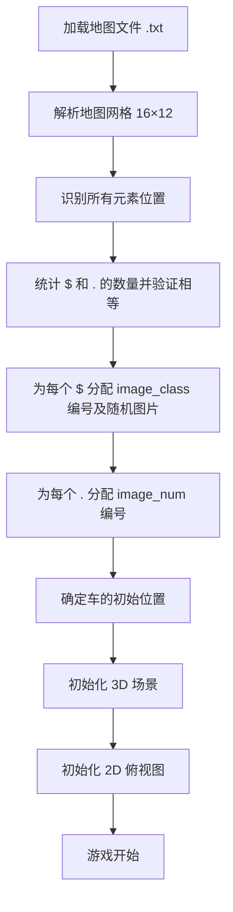
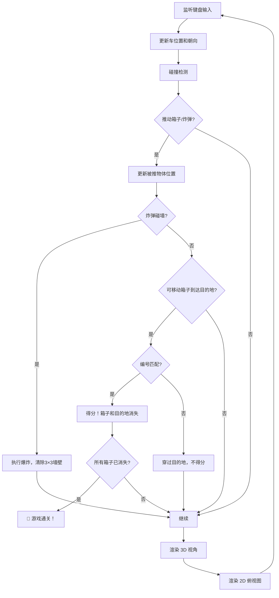

# 推箱子游戏 · 详细规划与实现方案

> **文档状态**：🟢 细节已确认 — 待后续补充后可开工  
> **最后更新**：2026-03-04 14:58

---

## 一、项目概述

### 1.1 项目背景

本项目是第21届全国大学生智能汽车竞赛·智能视觉组的**逆向工程模拟器**。目标是用 Python 复现比赛中使用的虚拟推箱子游戏系统，构建一个**通用平台**：

| 用途 | 说明 |
|------|------|
| 🎮 人工游玩 | 键盘操控 + Pygame 可视化，手动通关收集训练数据 |
| 🧪 算法验证 | 接入任意算法（路径规划、深度学习、强化学习等），最小改动即可运行 |
| 📊 数据采集 | 记录手动/自动通关的地图状态和离散化路线，供模型训练 |

> **设计哲学**：这不是一个“改不了代码的死系统”，而是一个**高度可 hack 的开放平台**。核心引擎与算法逻辑完全解耦，换算法只需改接入层。

### 1.2 核心玩法

玩家/Agent 驾驶一辆车在 **16×12** 的网格地图中移动，**将可移动箱子推到与其图案对应的编号目的地箱子上**。可视化画面分为上下两部分：
- **上半部分**（640×480）：车的 3D 第一人称视角 — Raycasting 渲染
- **下半部分**（640×480）：2D 俯视图 — Pygame 绘制

### 1.3 技术栈

| 层面 | 技术选择 |
|------|----------|
| 语言 | **Python 3.10+** |
| 游戏核心 | 纯 Python（无外部游戏引擎依赖） |
| 可视化 | **Pygame**（2D 俯视图 + Raycasting 3D 视角） |
| 环境接口 | **Gymnasium** 标准接口（`reset()` / `step()` / `render()`） |
| 图像资源 | 本地 jpg/png 文件（Pillow / Pygame 加载） |
| 配置管理 | Python dataclass / YAML |

---

## 二、游戏元素定义

### 2.1 地图网格

| 属性 | 值 |
|------|-----|
| 网格尺寸 | **16 列 × 12 行** |
| 每格逻辑大小 | 1 单位 × 1 单位 |
| 坐标系 | 地图文件中第1行对应 Y=0（顶部），第1列对应 X=0（左侧） |

### 2.2 元素类型与视觉表现

| 元素 | 地图符号 | 2D俯视图颜色 | 3D视角表现 | 物理属性 |
|------|----------|-------------|-----------|---------|
| **车（玩家）** | 无（动态生成） | 绿色+青色方块 | 第一人称摄像机原点 | 连续移动，不受网格对齐限制 |
| **墙壁** | `#` | 黑灰色 | 3D 石墙方块 | 不可穿越，不可推动 |
| **空气（空地）** | `-` | 蓝色地面 | 蓝色地面 | 可通行 |
| **目的地箱子** | `.` | 紫色方块 | 带数字编号贴图的方块 | 占位空间，车可穿过 |
| **可移动箱子** | `$` | 黄色方块 | 带卡通角色贴图的方块 | 连续移动，可被车推动 |
| **炸弹** | `*` | 红色方块 | 红色炸弹模型 | 连续移动，可被车推动，触墙爆炸 |

### 2.3 颜色参考（来自截图）

| 元素 | 2D 颜色值（参考） |
|------|-------------------|
| 车（主体） | `#00FF00` (绿) |
| 车（辅助） | `#00FFFF` (青) |
| 墙壁 | `#404040` (深灰) / `#202020` (黑) |
| 空地/通道 | `#0000FF` (蓝) |
| 可移动箱子 | `#FFFF00` (黄) |
| 目的地箱子 | `#FF00FF` (品红/紫) |
| 炸弹 | `#FF0000` (红) |
| 地图外区域 | `#C0C0C0` (灰色网格纹) |

---

## 三、地图系统

### 3.1 地图文件格式

地图存储为 [.txt](file:///e:/%E5%A4%A7%E4%BA%8C%E4%B8%8A/%E6%99%BA%E8%83%BD%E8%BD%A6/%E9%80%86%E5%90%91%E5%B7%A5%E7%A8%8B/maps/map3.txt) 文件，每行16个字符，共12行。

**符号定义**：
| 符号 | 含义 |
|------|------|
| `#` | 墙壁 |
| `-` | 空气/空地 |
| `.` | 目的地箱子（目标位置） |
| `$` | 可移动箱子（待推箱子） |
| `*` | 炸弹 |

**示例**（map3.txt）：

```
################
#-#---#--#----.#
#---#--#-####--#
##-###-#-#-----#
#-.#-#-#-#--#--#
#-##-#---------#
#--#-------##--#
#-*-------*-#--#
#--$-#-----$*--#
#-$--########--#
#----#.--------#
################
```

### 3.2 地图解析规则

1. 文件逐行读取，第 i 行第 j 个字符 → `map[i][j]`
2. 行索引 i 从 0（顶部）到 11（底部），列索引 j 从 0（左侧）到 15（右侧）
3. 最外圈必须全部为 `#`（不可炸毁的边界墙壁）
4. 地图中 `$` 的数量应等于 `.` 的数量（一一对应关系）

### 3.3 地图元素数量约束

- **可移动箱子 `$` 的数量** = **目的地箱子 `.` 的数量**（必须相等，形成一一配对）
- 可移动箱子数量 ≤ 10（因为 `image_num` 目录中有 00-09 共10个数字图）
- 炸弹 `*` 数量没有严格上限限制

---

## 四、角色系统（车）

### 4.1 生成位置

- 车始终在 **第2列（X=1）** 或 **倒数第2列（X=14）** 的 **最中间行** 刷新
- 具体中间位置：Y 方向地图行数为12，中间位置 = 地图中央（Y≈5.5，即第6行和第7行交界处）
- 初始朝向：**朝上**（Y 减小方向）

### 4.2 移动机制

| 属性 | 描述 |
|------|------|
| 运动模式 | **连续移动**（位置为浮点数，非网格对齐） |
| 移动方式 | WASD 控制前后左右平移 |
| 转向方式 | 左右方向键控制车身旋转 |
| 移动速度 | 默认值较低（便于精确操控），**可在设置中调节** |
| 旋转速度 | 默认值较低，**可在设置中调节** |
| 碰撞检测 | 不可穿越墙壁（碰撞时墙壁方向的速度分量归零，其他分量保留，即沿墙滑行） |
| 穿越规则 | **可穿过目的地箱子** |

### 4.3 操控详情

| 按键 | 功能 |
|------|------|
| `W` | 向车头方向前进 |
| `S` | 向车尾方向后退 |
| `A` | 向车身左侧平移 |
| `D` | 向车身右侧平移 |
| `←` (左方向键) | 车身逆时针旋转（左转） |
| `→` (右方向键) | 车身顺时针旋转（右转） |

---

## 五、箱子系统

### 5.1 可移动箱子

- **移动方式**：连续移动（被车推动时跟随车的推力方向移动）
- **推动逻辑**：车的碰撞体接触到箱子时，箱子沿推力方向移动
- **连锁推动**：**支持多级连锁推动**（车推箱子A → A推箱子B），推动时**不影响车速**
- **碰撞规则**：
  - 箱子不可穿越墙壁
  - 箱子不可穿越炸弹
- **3D 贴图**：从 `image_class` 的对应类别文件夹中**随机选取一张图**作为四个侧面的贴图

### 5.2 目的地箱子

- **物理属性**：纯占位标记，**车和可移动箱子都可穿过**
- **3D 贴图**：从 `image_num` 文件夹中取对应编号的数字图作为四个侧面的贴图
- **编号规则**：地图中第 n 个目的地箱子（按扫描顺序）使用编号 n 的数字图

### 5.3 配对与得分机制

```
image_class 类别文件夹名格式：{编号}{角色名}
  例如：00mickey_mouse, 01pikachu, 02spongebob_squarepants, ...

image_num 数字图文件名格式：{编号}.jpg
  例如：00.jpg, 01.jpg, 02.jpg, ...
```

**配对规则**：
- `image_class` 的编号前缀（如 `00`, `01`）与 `image_num` 的编号（如 [00.jpg](file:///e:/%E5%A4%A7%E4%BA%8C%E4%B8%8A/%E6%99%BA%E8%83%BD%E8%BD%A6/%E9%80%86%E5%90%91%E5%B7%A5%E7%A8%8B/image_num/00.jpg), [01.jpg](file:///e:/%E5%A4%A7%E4%BA%8C%E4%B8%8A/%E6%99%BA%E8%83%BD%E8%BD%A6/%E9%80%86%E5%90%91%E5%B7%A5%E7%A8%8B/image_num/01.jpg)）一一对应
- 例如：贴有 `00mickey_mouse` 类别图案的可移动箱子 → 必须推到贴有 `00` 数字的目的地箱子上

**得分判定**：
- ✅ 正确配对：可移动箱子与目的地箱子的编号匹配 → **得分，箱子和目的地同时消失**
- ❌ 错误配对：编号不匹配 → **可移动箱子直接穿过目的地箱子**，不产生任何效果

### 5.4 配对分配逻辑

地图加载时：
1. 扫描地图文件，按从上到下、从左到右的顺序收集所有 `$` 和 `.` 的位置
2. `$` 和 `.` 各自按扫描顺序排列
3. 将 0 ~ N-1 的编号**随机打乱**后分配给各个 `$`
4. 第 i 个 `$` 获得的编号 k → 使用 `image_class` 编号 k 的类别（从对应文件夹随机选图）
5. 第 j 个 `.` 同样随机分配一个编号 m → 使用 `image_num` 中编号 m 的数字图
6. 配对关系：编号相同的 `$` 和 `.` 互相对应

---

## 六、炸弹系统

### 6.1 基本行为

- **移动方式**：连续移动，可被车推动（与可移动箱子类似）
- **反弹/穿过**：炸弹不可穿过墙壁

### 6.2 爆炸机制

| 属性 | 描述 |
|------|------|
| 触发条件 | 炸弹被推向墙壁（炸弹碰撞到墙壁时触发） |
| 爆炸范围 | **以炸弹所在位置为中心的 3×3 区域** |
| 可炸毁对象 | 范围内的**中间墙壁**全部被炸毁（变为空地） |
| 不可炸毁对象 | **最外圈墙壁**不可被炸毁 |
| 对其他物体的影响 | **不会影响**范围内的可移动箱子、其他炸弹 |
| 爆炸后状态 | 炸弹本身被消耗消失 |

### 6.3 爆炸范围计算

炸弹碰撞到墙壁时，取炸弹当前所在的网格坐标 `(bx, by)`（四舍五入到最近整数网格）：
- 清除 `(bx-1, by-1)` 到 `(bx+1, by+1)` 范围内的所有墙壁
- 但排除最外圈（`x=0`, `x=15`, `y=0`, `y=11`）的墙壁
- **不影响**范围内的箱子或其他炸弹

---

## 七、系统架构

### 7.1 分层架构

```
┌─────────────────────────────────────────────────────┐
│           使用层 (User / Agent)                       │
│  ┌──────────┐  ┌──────────────┐  ┌───────────────┐  │
│  │ 键盘游玩  │  │ 你的算法脚本  │  │ RL / DL 训练  │  │
│  └─────┬────┘  └──────┬───────┘  └──────┬────────┘  │
├────────┼──────────────┼─────────────────┼────────────┤
│        │              │                 │            │
│  ┌─────┴──────────────┴─────────────────┴───────────┐ │
│  │       Gymnasium 接口层 (SokobanEnv)                 │ │
│  │  reset() / step(action) / render() / close()      │ │
│  │  观测: matrix | pixel | both (可配置)             │ │
│  │  动作: 连续 | 离散包装器 (可配置)                │ │
│  └───────────────────────┬──────────────────────────┘ │
│                         │                            │
├─────────────────────────┼────────────────────────────┤
│                         │                            │
│  ┌───────────────────────┴──────────────────────────┐ │
│  │          游戏核心引擎 (GameEngine)                │ │
│  │  地图解析 | 物理/碰撞 | 推动逻辑 | 爆炸逻辑      │ │
│  │  状态管理 | 胜利判定 | 配对系统                │ │
│  └───────────────────────┬──────────────────────────┘ │
│                         │                            │
├─────────────────────────┼────────────────────────────┤
│                         │                            │
│  ┌───────────────────────┴──────────────────────────┐ │
│  │       渲染层 (Renderer) — 可选启用                │ │
│  │  Pygame 窗口: 640x960 (上3D + 下2D, 1:1拼接)      │ │
│  │  3D Raycasting 视角 | 2D 俯视图                  │ │
│  └──────────────────────────────────────────────────┘ │
└─────────────────────────────────────────────────────┘
```

### 7.2 核心模块划分

| 模块 | 文件 | 职责 |
|------|------|------|
| `GameEngine` | `engine.py` | 纯逻辑：地图、物理、碰撞、推动、爆炸、胜利判定。**无任何渲染依赖**，可无头运行 |
| `SokobanEnv` | `env.py` | Gymnasium 接口包装：`reset()` / `step()` / `render()`。调用 GameEngine |
| `Renderer` | `renderer.py` | Pygame 渲染：组合 2D 俯视图 + 3D Raycasting。仅在 `render()` 调用时工作 |
| `Raycaster` | `raycaster.py` | 3D 第一人称 Raycasting 引擎。输出 640x480 像素数组 |
| `MapLoader` | `map_loader.py` | 地图 txt 解析、元素提取、配对分配 |
| `Config` | `config.py` | 全局可调参数（速度、FOV、窗口尺寸等）。dataclass 实现 |
| `DiscreteWrapper` | `wrappers.py` | 离散动作空间包装器，套在 SokobanEnv 外层 |
| 人工游玩入口 | `play.py` | 键盘控制 + 渲染，用于手动游玩和打数据 |

### 7.3 观测空间 (Observation)

通过配置切换，支持三种模式：

| 模式 | 内容 | 用途 |
|------|------|------|
| `"matrix"` | 16x12 地图状态数组 + 车位置/朝向 + 各箱子位置和编号 | 纯逻辑算法、路径规划 |
| `"pixel"` | 渲染后的像素图 (640x960 或仅 3D 640x480) 的 numpy 数组 | 视觉模型、模拟真实比赛 |
| `"both"` | 以上两者合并为 dict | 混合训练 |

### 7.4 动作空间 (Action)

**核心层 — 连续控制**：
```python
# action = [forward_speed, strafe_speed, turn_rate]
# forward_speed: -1.0 ~ 1.0 (后退 ~ 前进)
# strafe_speed:  -1.0 ~ 1.0 (左移 ~ 右移)
# turn_rate:     -1.0 ~ 1.0 (左转 ~ 右转)
action_space = spaces.Box(low=-1.0, high=1.0, shape=(3,))
```

**离散包装器**（via `DiscreteWrapper`）：
```python
# 0=前进, 1=后退, 2=左移, 3=右移, 4=左转, 5=右转, 6=不动
action_space = spaces.Discrete(7)
```

### 7.5 画面渲染

渲染仅在 `render()` 调用时执行，**不影响无头训练性能**。

**3D 第一人称视角**（上半 640x480）：
- Raycasting 实现（类 Wolfenstein 3D）
- FOV = 90°
- 墙壁：深色石砖贴图
- 可移动箱子：四侧卡通角色贴图
- 目的地箱子：四侧数字编号贴图
- 炸弹：红色方块
- 地面蓝色、天空灰白
- 消失/爆炸：直接移除，无动画

**2D 俯视图**（下半 640x480）：
- 16x12 彩色方块网格
- 车：青色边（车头）+ 绿色边（车尾）
- 实时连续位置更新
- 地图外围灰色网格纹背景

---

## 八、图像资源映射

### 8.1 目的地箱子贴图（image_num）

| 编号 | 文件路径 | 显示内容 |
|------|---------|---------|
| 0 | [image_num/00.jpg](file:///e:/%E5%A4%A7%E4%BA%8C%E4%B8%8A/%E6%99%BA%E8%83%BD%E8%BD%A6/%E9%80%86%E5%90%91%E5%B7%A5%E7%A8%8B/image_num/00.jpg) | 数字 "0" |
| 1 | [image_num/01.jpg](file:///e:/%E5%A4%A7%E4%BA%8C%E4%B8%8A/%E6%99%BA%E8%83%BD%E8%BD%A6/%E9%80%86%E5%90%91%E5%B7%A5%E7%A8%8B/image_num/01.jpg) | 数字 "1" |
| 2 | [image_num/02.jpg](file:///e:/%E5%A4%A7%E4%BA%8C%E4%B8%8A/%E6%99%BA%E8%83%BD%E8%BD%A6/%E9%80%86%E5%90%91%E5%B7%A5%E7%A8%8B/image_num/02.jpg) | 数字 "2" |
| 3 | [image_num/03.jpg](file:///e:/%E5%A4%A7%E4%BA%8C%E4%B8%8A/%E6%99%BA%E8%83%BD%E8%BD%A6/%E9%80%86%E5%90%91%E5%B7%A5%E7%A8%8B/image_num/03.jpg) | 数字 "3" |
| 4 | [image_num/04.jpg](file:///e:/%E5%A4%A7%E4%BA%8C%E4%B8%8A/%E6%99%BA%E8%83%BD%E8%BD%A6/%E9%80%86%E5%90%91%E5%B7%A5%E7%A8%8B/image_num/04.jpg) | 数字 "4" |
| 5 | [image_num/05.jpg](file:///e:/%E5%A4%A7%E4%BA%8C%E4%B8%8A/%E6%99%BA%E8%83%BD%E8%BD%A6/%E9%80%86%E5%90%91%E5%B7%A5%E7%A8%8B/image_num/05.jpg) | 数字 "5" |
| 6 | [image_num/06.jpg](file:///e:/%E5%A4%A7%E4%BA%8C%E4%B8%8A/%E6%99%BA%E8%83%BD%E8%BD%A6/%E9%80%86%E5%90%91%E5%B7%A5%E7%A8%8B/image_num/06.jpg) | 数字 "6" |
| 7 | [image_num/07.jpg](file:///e:/%E5%A4%A7%E4%BA%8C%E4%B8%8A/%E6%99%BA%E8%83%BD%E8%BD%A6/%E9%80%86%E5%90%91%E5%B7%A5%E7%A8%8B/image_num/07.jpg) | 数字 "7" |
| 8 | [image_num/08.jpg](file:///e:/%E5%A4%A7%E4%BA%8C%E4%B8%8A/%E6%99%BA%E8%83%BD%E8%BD%A6/%E9%80%86%E5%90%91%E5%B7%A5%E7%A8%8B/image_num/08.jpg) | 数字 "8" |
| 9 | [image_num/09.jpg](file:///e:/%E5%A4%A7%E4%BA%8C%E4%B8%8A/%E6%99%BA%E8%83%BD%E8%BD%A6/%E9%80%86%E5%90%91%E5%B7%A5%E7%A8%8B/image_num/09.jpg) | 数字 "9" |

### 8.2 可移动箱子贴图（image_class）

| 编号 | 类别文件夹 | 角色名称 | 可用图片数量 |
|------|-----------|---------|------------|
| 0 | `00mickey_mouse` | 米奇老鼠 | 12张 |
| 1 | `01pikachu` | 皮卡丘 | 待确认 |
| 2 | `02spongebob_squarepants` | 海绵宝宝 | 待确认 |
| 3 | `03pleasant_sheep` | 喜羊羊 | 待确认 |
| 4 | `04donald_duck` | 唐老鸭 | 待确认 |
| 5 | `05nezha` | 哪吒 | 待确认 |
| 6 | `06big_head_son` | 大头儿子 | 待确认 |
| 7 | `07gg_bond` | 猪猪侠 | 待确认 |
| 8 | `08calabash_brothers` | 葫芦兄弟 | 8张 |
| 9 | `09grey_wolf` | 灰太狼 | 待确认 |

---

## 九、游戏流程

### 9.1 初始化流程



### 9.2 游戏主循环



### 9.3 胜利条件

所有可移动箱子都被推到正确对应的目的地箱子位置 → 全部消失 → **游戏通关**

---

## 十、碰撞检测系统

### 10.1 碰撞体模型

| 元素 | 碰撞体形状 | 碰撞体大小 |
|------|-----------|-----------|
| 车 | 正方形 | **1.0 × 1.0 单位**（严格一格） |
| 墙壁 | 正方形 | 1.0 × 1.0 单位 |
| 可移动箱子 | 正方形 | 1.0 × 1.0 单位 |
| 目的地箱子 | 无碰撞体（可穿过） | — |
| 炸弹 | 正方形 | 1.0 × 1.0 单位 |

### 10.2 推动检测逻辑

1. 计算车的运动方向向量
2. 检测车的碰撞体是否与箱子/炸弹碰撞体重叠
3. 如果重叠：
   - 计算推力方向（车中心 → 箱子中心方向的主轴分量）
   - 检测箱子沿推力方向是否有障碍物（墙壁、其他箱子）
   - 无障碍物：箱子被推动
   - 有障碍物（墙壁）：
     - 如果是普通箱子：箱子不动，车被阻挡
     - 如果是炸弹：触发爆炸

### 10.3 配对检测逻辑

当可移动箱子的中心进入目的地箱子所在的网格范围时：
- 检查两者编号是否匹配
- ✅ 匹配：两者同时消失
- ❌ 不匹配：可移动箱子穿过（目的地箱子本身无碰撞体）

---

## 十一、已确认问题汇总

| # | 问题 | 确认结果 |
|---|------|----------|
| 1 | 车初始朝向 | **朝上** |
| 2 | 移动/旋转速度 | 默认较低（便于操控），**可在设置中调节** |
| 3 | 连锁推动 | **支持**多级连锁，推动时**不影响车速** |
| 4 | 爆炸对箱子/炸弹的影响 | **不影响**，只炸毁墙壁 |
| 5 | 碰墙行为 | 墙壁方向的**速度分量归零**（沿墙滑行） |
| 6 | 配对分配规则 | **有随机成分** |
| 7 | 3D 墙壁贴图 | **石砖贴图** |
| 8 | FOV | **90°** |
| 9 | 消失动画 | **不需要** |
| 10 | 爆炸动画 | **不需要** |
| 11 | 2D 朝向指示器 | **不需要**（青色=车头，绿色=车尾） |
| 12 | 计时器 | **暂不需要** |
| 13 | 步数统计 | **不需要** |
| 14 | 重新开始按钮 | **需要** |
| 15 | 关卡选择 | **需要**（map1/map2/map3 切换） |
| 16 | 得分面板 | **不需要** |
| 17 | 车碰撞体大小 | **严格 1 格**（1.0 × 1.0） |
| 18 | 窗口分辨率 | 上下各 **640×480**，1:1 竖向拼接 = **640×960** |
| 19 | 音效 | **不需要** |
| 20 | 手机触屏 | **不需要** |

---

## 十二、文件目录结构

### 12.1 现有资源

```
逆向工程/
├── maps/                 # 地图文件
│   ├── map1.txt
│   ├── map2.txt
│   └── map3.txt
├── image_num/            # 目的地箱子贴图（数字 0-9）
│   └── 00.jpg ... 09.jpg
├── image_class/          # 可移动箱子贴图（10 个卡通角色类别）
│   └── 00mickey_mouse/ ... 09grey_wolf/
└── 第二十一届智能车竞赛智能视觉组推箱子规则详解.md
```

### 12.2 计划代码结构

```
逆向工程/
├── maps/                 # 地图资源（已有）
├── image_num/            # 数字贴图（已有）
├── image_class/          # 角色贴图（已有）
├── textures/             # 墙壁石砖等通用贴图
│
├── engine.py             # 游戏核心引擎（纯逻辑，无渲染）
├── map_loader.py         # 地图解析与配对分配
├── config.py             # 全局配置（dataclass）
├── env.py                # Gymnasium 环境接口
├── wrappers.py           # 离散动作等包装器
├── renderer.py           # Pygame 渲染主控（组合 2D + 3D）
├── raycaster.py          # 3D Raycasting 引擎
├── play.py               # 人工游玩入口
└── requirements.txt      # pygame, gymnasium, numpy, pillow
```
