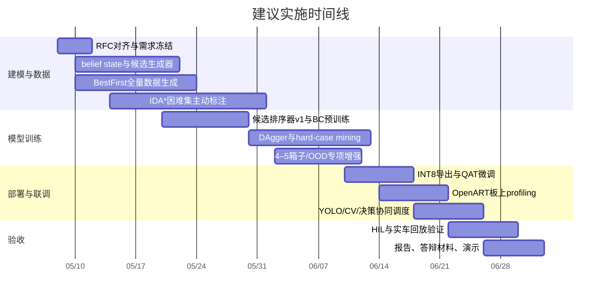

# 智能车推箱子专用决策网络深度研究与执行方案

## 执行摘要

基于已提供的 RFC，这份文档的核心任务不是“把所有系统都重新做一遍”，而是在**严格 MCU 部署约束**下，为一个带有**部分可观测性、不可逆推箱、炸弹爆破、死锁风险、实体 ID 配对**的离散决策问题，提出一套可落地的专用网络架构、训练范式、部署路径与验收方案。RFC 明确给出了目标系统、监督来源、硬件预算、评估口径与胜率门槛，但**没有明确预算、团队规模、截止日期、相机参数、精确的各 phase max_steps、回库车库几何细节以及检测器置信度接口**；这些都应在工程计划中标注为“未指定”。此外，RFC 在“规则层面允许 1–5 个箱子”，但训练 phase 描述主要覆盖到 1–3 个箱子，构成一个重要的**潜在分布缺口**，必须通过合成数据与 OOD 评测主动补齐。fileciteturn0file0

我给出的首选方案不是更大的端到端模型，而是**单模型、神经—符号混合的候选动作排序器**：用显式 belief state 处理部分可观测性，用经典几何/图搜索生成合法候选宏动作，用一个极小的深度可分离卷积主干提取全局空间上下文，再用共享 MLP 对每个候选动作评分，最后交给 BFS/执行器落地为物理动作。这个方案直接利用了本题的归纳偏置：网格几何适合卷积，少量可交换实体适合集合/共享参数评分，死锁与可达性可由经典算法低成本显式给出，而不是浪费模型容量去“重新发现”这些规则。fileciteturn0file0 citeturn8view0turn8view1turn11view1turn15view1

训练上，建议以**搜索蒸馏 + DAgger**为主，而不是把首发方案押在全量离线 RL 或 world model 上。原因很简单：RFC 已经提供了 IDA*、加权 A* / BestFirst、AutoPlayer 三类老师，其中前两者直接产出高质量推送序列；这使得“先用强老师给方向、再用 DAgger 修正分布偏移”的路线，比从静态数据直接做 MuZero 式建模更贴合当前资源与时延边界。离线 RL 可以作为**第二阶段补强**，其中 IQL / advantage-weighted BC 更适合作为“从优质静态数据中再提一点性能”的保守增强；CQL 仅在 BestFirst / AutoPlayer 数据占比非常高、且明显存在 OOD 动作过估计时才作为备选。citeturn3view0turn20view0turn3view1turn15view5

部署上，推荐把策略网络控制在**约 3–6 万参数**区间，INT8 后模型权重约 **30–65 KB**，远低于 RFC 给出的 **≤500 KB** 上限；结合 14×10 crop、事件触发式推理、最小化 op resolver 与静态 arena，推理 RAM 预计可控制在 **128–320 KB** 量级。若训练后 PTQ 量化使 win_rate 下降接近或超过 RFC 允许的 **2pp**，则应切换为短程 QAT 微调。这个量级与 MCU 专用轻量网络、TFLM/CMSIS-NN 的最佳实践是一致的。fileciteturn0file0 citeturn15view0turn15view4turn15view1turn16view0turn14search3turn13search0turn13search3

## 文档任务与约束拆解

RFC 明确要求的“可交付成果”本质上是：在不受既有 baseline 束缚的前提下，重新设计**状态表示、动作解码、训练范式、部署图与理论论证**，并证明该设计能在 OpenART 类板卡上达到 phase 级 win_rate 目标。它并不要求你在这份答复里真的把最终模型训练出来，而是要求你提交**架构设计 + 数学/工程论证**。fileciteturn0file0

| 主题 | RFC 明确内容 | 提炼后的执行任务 | 未指定项 |
|---|---|---|---|
| 系统目标 | 小型 MCU 上实时决策，输入为当前游戏状态，输出能驱动智能车物理动作的指令序列 | 设计“状态 → 宏动作 → 低层执行”的完整决策栈 | 低层协议细节未指定 |
| 任务环境 | 16×12 网格，外圈固定墙，可玩区域 14×10，箱子/目标 ID 配对，含炸弹、FOV、遮挡、死锁 | 用可部署表示描述几何、实体、记忆、未知 ID 与炸弹规则 | garage 位置和回库控制细节未指定 |
| 监督信号 | IDA*、BestFirst、AutoPlayer，可生成 10^5–10^6 级训练样本 | 设计老师优先级、数据混合、query 预算与 hard-case 挖掘 | 老师调用预算未指定 |
| 硬件约束 | 权重 ≤500 KB，arena ≤2 MB，单次推理 ≤50 ms，TFLM op 受限，禁用 LSTM/GRU/标准注意力 | 网络必须是纯 Conv/FC/Pool/Add/Concat 风格，且最好单模型 | 检测模型与策略调度细节未指定 |
| 评估 | deterministic 推理；phase 1–5 ≥95%，phase 6 ≥90%；INT8 下降 ≤2pp | 设计离线评测、量化评测、HIL 评测与上线门槛 | 各 phase 精确 max_steps 仅给 30–120 范围 |
| 交付形式 | 架构方案 + 数学论证，5–20 页 PDF / Markdown | 输出架构图、层表、训练计划、实验矩阵、风险与备选 | 预算/团队/截止日期未指定 |

注：表中任务与约束均直接来自 RFC。fileciteturn0file0

从“完成文档中的所有任务”的角度，我建议把研发工作拆成六个并行但可串联的工程任务，而不是只做“一个模型训练脚本”。下表按你要求列出每项任务的知识域、数据类型、工具/软件与计算资源。

| 任务 | 所需知识领域 | 需要的数据类型 | 工具 / 软件 | 计算资源 |
|---|---|---|---|---|
| belief state 与状态表示 | 离散规划、部分可观测决策、几何可见性、图搜索 | 符号状态、FOV 可见性、ID 识别记录、目标检测置信度 | Python 仿真器、BFS、ray-casting、单元测试框架 | CPU 即可，板上只需轻量 C/C++ 实现 |
| 候选宏动作生成 | 推箱规则、死锁检测、搜索启发、约束满足 | 合法推送、爆破效果、扫描视点、回库候选 | 模拟器、候选生成器、规则测试集 | CPU；板上 O(140) 级 BFS/规则判断 |
| 神经排序器设计 | 轻量 CNN、集合/共享参数模型、量化部署 | 14×10 栅格张量、候选动作特征矩阵 | PyTorch / TensorFlow、Netron、TFLite 转换器 | RTX 5060 Ti 足够；板上 INT8 推理 |
| 训练与老师蒸馏 | 模仿学习、DAgger、离线 RL、课程学习 | IDA* / BestFirst / AutoPlayer 轨迹、价值标签、hard negatives | 训练脚本、数据缓存、实验追踪 | GPU 负责训练；CPU 负责老师求解 |
| 量化与 MCU 部署 | TFLM、CMSIS-NN、INT8 量化、算子融合 | representative dataset、板上 profiling 数据 | urlTFLM 官方文档turn5search0、urlTFLM C++ 库说明turn14search3、urlCMSIS-NN 官方文档turn12search5 | OpenART mini / Plus 实板测试 |
| 端到端评测与实车集成 | 系统工程、嵌入式调度、鲁棒性测试 | sim 结果、INT8 结果、HIL 日志、真实定位与识别误差 | HIL 脚本、日志回放、板上 benchmark、故障注入 | 训练机 + 开发板 + 赛场联调 |

注：RFC 已说明可直接复用仿真器、老师求解器、baseline 代码、训练机和 OpenART mini 实物，因此新增工作重点不在“重新搭建基础设施”，而在数据/策略/部署协同。fileciteturn0file0

伦理、安全与合规方面，这个项目几乎不涉及个人隐私和受保护数据，但存在三类必须显式管理的风险。第一是**赛事合规**：不得依赖板外推理或超规则硬件；这一点既来自 RFC 的硬件限定，也与赛事主办方的竞赛规范一致。第二是**物理安全**：策略错误可能导致冲撞、误推、越界或误爆。第三是**开源许可证合规**：如果使用 TFLM、CMSIS-NN、MCUNet/TinyEngine 代码或思路，必须保留 Apache-2.0 / MIT 许可链。fileciteturn0file0 citeturn7search0turn14search2turn12search2turn19search0turn19search5

| 风险主题 | 风险等级 | 触发点 | 缓解措施 |
|---|---|---|---|
| 赛事规则违规 | 中 | 使用板外算力、多模型混跑不稳定后临时绕过规则 | 坚持单模型、板上推理、训练时与部署时算子一致 |
| 物理安全 / 误爆 | 高 | 炸弹对角规则、死锁、执行抖动 | 宏动作前置合法性检查、爆破前仿真确认、越界 watchdog |
| 识别误判罚时 | 高 | 单帧误识别导致错误 ID 绑定 | belief state 保留置信度与候选集合；双帧确认或排除法再写死 ID |
| 许可证 / 可复现性 | 中 | 直接拷贝外部代码、实验记录缺失 | 建立 LICENSE-BOM、导出脚本、配置锁定、模型签名 |

这些风险与缓解措施都应该被写入验收文档，而不是留到临场调试时再处理。fileciteturn0file0

## 相关研究与工业实践

本题最重要的研究结论，不是“哪篇论文在通用 benchmark 上最好”，而是**哪些归纳偏置和工程做法与本题的结构同构**。在 entity["video_game","Sokoban","box-pushing puzzle game"] 领域，经典工作早就表明：域知识、死锁识别和启发式裁剪能把搜索树规模压缩几个数量级；这意味着即使最终部署网络很小，也不应该放弃显式规则与候选过滤。与之对应，现代模仿学习与搜索蒸馏文献则说明，强老师 + 分布校正比单纯 BC 更适合序列决策；而集合不变性和轻量 CNN 文献，则直接支持“共享参数候选排序器 + 超小卷积主干”的设计。citeturn0search5turn3view0turn20view0turn8view0turn15view0turn15view1

| 方法 / 来源 | 简要原理 | 优点 | 缺点 | 本题适用性 |
|---|---|---|---|---|
| urlSokoban: Enhancing General Single-Agent Search Methods Using Domain Knowledgehttps://doi.org/10.1016/S0004-3702(01)00109-6 | 用死锁、域启发、裁剪强化单智能体搜索 | 可解释、最贴近推箱本质 | 在线算太贵 | 非常适合做老师与规则特征。citeturn0search2turn0search5 |
| urlDAggerturn3view0 | 在学习器诱导分布上持续聚合数据 | 有理论地缓解 BC 累积误差 | 需要老师回标，数据流水线更复杂 | 适合 phase 4–6。citeturn3view0 |
| urlThinking Fast and Slow with Deep Learning and Tree Searchturn20view0 | 搜索负责“想”，网络负责“泛化” | 直接契合“老师搜索 → 学生部署” | 在线树搜索不一定板上可承受 | 很适合做训练范式，而不是直接上大树搜索。citeturn20view0 |
| urlDeep Setsturn8view0 | 构造对集合顺序不敏感的表示 | 对少量箱子/目标/炸弹天然合适 | 纯集合模型不擅长几何局部模式 | 适合作为候选动作共享评分的理论依据。citeturn8view0 |
| urlPointer Networksturn8view1 | 从可变长度输入中“指向”一个元素作为输出 | 适合变长动作集合 | 原始形式依赖 attention/RNN，不适合直接 MCU 部署 | 适合作为“候选动作排序”思想来源。citeturn8view1 |
| urlValue Iteration Networksturn15view3 | 在网络中嵌入可微规划模块 | 对网格规划有强归纳偏置 | 对多实体 ID、炸弹和 POMDP 处理不足；仍增加算量 | 可作为对照基线，不建议作为首发。citeturn15view3 |
| urlAn Investigation of Model-Free Planningturn21search4 与 urlPlanning in a recurrent neural network that plays Sokobanturn11view0 | 证明 RNN 在 Sokoban 中能涌现“规划性” | 说明“学会规划”并非不可能 | 依赖 recurrent 结构和额外内部计算，和 RFC 的算子约束冲突 | 可作研究参考，不建议首发部署。citeturn21search4turn11view0 |
| urlBeyond Tabula-Rasa: a Modular Reinforcement Learning Approach for Physically Embedded 3D Sokobanturn11view1 | 感知—计划—执行模块化 RL 在 Mujoban 上显著优于单体 RL | 直接支持模块化设计 | 平台更大、更重 | 与本题“高层决策 + 低层经典控制”高度一致。citeturn11view1 |
| urlMobileNetV3turn15view0、urlGhostNetturn15view4、urlMCUNetturn15view1 | 硬件感知轻量骨干与 MCU 级协同设计 | 小模型、高吞吐、低内存 | 需针对目标 op 集收缩结构 | 本题卷积主干应借鉴这些思路，而不是照搬 ResNet/Transformer。citeturn15view0turn15view4turn15view1 |

工业与开源侧，最值得直接借鉴的不是“某个大模型框架”，而是**微控制器上的推理工程经验**。官方 TFLM 文档强调它面向微控制器/资源受限设备，并在 C++ 库说明中明确提醒：`all_ops_resolver` 会拉入全部运算、占用大量内存，因此生产部署应使用 `micro_mutable_op_resolver` 只注册实际用到的 op。CMSIS-NN 官方文档则说明它提供 Cortex-M 上的高效 Conv/FC/Pool/Softmax 内核，并遵循 TFLM 的 int8/int16 量化规范。MCUNet / TinyEngine 的开源实践进一步说明，**网络结构设计与推理引擎必须协同考虑**，才能真正吃满 MCU 资源。citeturn5search0turn14search3turn16view0turn19search0turn19search5

| 开源 / 官方资产 | 用途 | 许可 / 适配建议 |
|---|---|---|
| urlTFLM 官方文档turn5search0 / urlTFLM GitHub 仓库turn14search2 | 目标部署运行时、模型导出约束、op 注册 | Apache-2.0；首发路线首选 |
| urlCMSIS-NN 官方文档turn12search5 / urlCMSIS-NN GitHub 仓库turn12search2 | Cortex-M 优化内核，提升 Conv/FC/Pool/Softmax 性价比 | Apache-2.0；与 TFLM 一起用 |
| urlMCUNet GitHub 仓库turn19search0 / urlTinyEngine GitHub 仓库turn19search5 | 参考 TinyML 结构与内存调度思路 | MIT；作为后续强化路线，而非首发主线 |

把这些文献与工程约束综合起来，方法比较的结论非常清晰：**推荐的不是“最强表达能力”的方案，而是“在当前规则、老师、部署栈、时间预算下综合得分最高”的方案**。下表按“可部署性 30% + phase 6 鲁棒性 25% + POMDP 处理 15% + 数据效率 15% + 工程风险 15%”给出 1–5 分评分，分值是研究判断，不是已运行出来的实验值。fileciteturn0file0 citeturn3view0turn20view0turn11view1turn21search4turn15view1

| 方案 | 可部署性 | phase 6 鲁棒性 | POMDP 处理 | 数据效率 | 工程风险 | 加权总分 |
|---|---:|---:|---:|---:|---:|---:|
| 平面 54 类 CNN+MLP | 4.0 | 2.5 | 2.5 | 3.5 | 4.0 | 3.33 |
| ConvRNN / DRC 规划器 | 1.0 | 4.5 | 4.5 | 3.0 | 1.5 | 2.77 |
| MuZero / 世界模型 + 树搜索 | 1.0 | 5.0 | 4.0 | 2.0 | 1.0 | 2.60 |
| 纯符号搜索 + 学习启发 | 4.0 | 3.5 | 4.0 | 3.0 | 3.0 | 3.57 |
| **推荐：神经—符号候选排序器** | **5.0** | **4.5** | **5.0** | **4.5** | **4.0** | **4.65** |

## 推荐技术方案与实验设计

### 总体分层

推荐系统采用**显式记忆 + 宏动作候选生成 + 轻量候选排序网络 + BFS 执行器**的四段式结构。它保留 RFC 当前工程里“高层决策与低层规划解耦”的优点，但把“扁平 54 类 softmax”替换成**变长候选集合上的共享评分**，让动作空间随着箱子、炸弹、扫描视点数量自然变化。这样做的直接收益是：当箱子数量、目标数量、未知 ID 数量变化时，模型不需要为每个绝对动作槽位重新学习一次，而只需学习“如何评价一个候选动作”。这与集合不变性、Pointer-like 变长选择和搜索蒸馏的思路一致。fileciteturn0file0 citeturn8view0turn8view1turn20view0

```text
[视觉/定位/识别]
        ↓
[Belief State]
  - 14×10 静态墙图
  - player 位置/朝向
  - box/target/bomb 位置
  - 已知/未知/推断 ID
  - FOV 可见性与遮挡记忆
        ↓
[Candidate Generator]
  - push(box, dir)
  - push(bomb, dir/diag)
  - scan(viewpoint, heading)
  - return_home
  - 非法/死锁候选直接屏蔽
        ↓
[Neural Candidate Ranker]
  - grid DS-CNN backbone
  - shared MLP candidate encoder
  - masked softmax policy
  - optional value head
        ↓
[BFS / 低层执行器]
        ↓
[引擎 / 实车]
```

### 状态编码

RFC 已明确指出外圈墙整局固定、对决策“毫无信息量”，因此输入张量应该**默认 crop 到中心 14×10**，把边界常量从模型里拿掉。部分可观测性不通过 RNN 硬学，而通过**外部 belief state**显式维护：每个箱子/目标维护 `位置、类型、ID 候选集合、是否已识别、最后可见时刻、当前遮挡状态`；当同类实体仅剩一个未知时，直接用排除法填补 ID。这条路线直接顺着 RFC 的规则走，也绕开了 LSTM/GRU 被禁、attention 难降级的问题。fileciteturn0file0

我建议把状态拆成两部分：

| 输入块 | 形式 | 说明 |
|---|---|---|
| 栅格张量 `X_grid` | 14×10×28 | `wall`、`player`、`bomb`、`box_unknown`、`target_unknown`、`box_id_0..9`、`target_id_0..9`、`deadlock_cell`、`reachable_cell`、`visible_now` |
| 全局向量 `x_global` | 16–24 维 | 玩家朝向 one-hot、剩余箱子数、未知 ID 数、已完成配对数、是否存在可爆破内墙、是否已进入回库阶段 |
| 候选动作矩阵 `F` | `A_max × 48` | 每个候选的类型、方向、对象位置、目标匹配状态、BFS 距离、推送合法性、是否爆破、墙体移除数、死锁标志、信息增益等 |

其中 `A_max` 建议固定为 **56** 用于 padding。这个上界来自规则本身：最多 5 个箱子，每个最多 4 个正交推送，共 20；最多 3 个炸弹，每个理论上最多 4 个正交 + 4 个对角爆破候选，共 24；再加扫描视点上限 6 和回库动作 1，总计 51，留一点冗余到 56 即可。这样既能覆盖完整规则，也基本贴着当前 baseline 的 54 类数量级。fileciteturn0file0

这个表示的关键，不在“通道数多不多”，而在它同时满足四件事。第一，**平移等变**：几何局部模式由卷积处理。第二，**实体置换鲁棒**：候选由共享 scorer 处理，不依赖箱子在数组中的顺序。第三，**部分可观测性可外显**：未知 ID 和推断 ID 都是状态的一部分。第四，**规则强特征前置**：RFC 已说明 BFS 距离、推送距离场、可达性、死角、视野状态都能在 1 ms 内求出，因此这些不应只当作评测辅助，而应直接喂给策略网络。fileciteturn0file0 citeturn8view0turn15view2

### 网络结构与参数估计

我推荐的默认网络是一个**极小型 depthwise-separable CNN + shared action scorer**。部署图只使用 RFC 允许的 `Conv2D / DepthwiseConv2D / FullyConnected / ReLU / Reshape / Softmax / Concat / Add / AvgPool2D`，不保留 BatchNorm、LayerNorm、RNN 或标准 attention；若训练时临时使用 BN，导出前必须 fuse。TFLM 官方文档与 C++ 库说明都支持这种“只注册所需 op、静态图、静态 arena”的部署方式，CMSIS-NN 则刚好提供这组核心内核的 Cortex-M 优化实现。fileciteturn0file0 citeturn14search3turn16view0

数学形式如下。设 belief state 为 \(B_t\)，候选集合为 \(\mathcal{A}(B_t)=\{a_1,\dots,a_m\}\)。  
栅格编码器：
\[
g_t=\psi(X_{\text{grid}},x_{\text{global}})\in\mathbb{R}^{48}
\]
候选编码器（共享参数）：
\[
z_i=\phi(f_i)\in\mathbb{R}^{32},\quad i=1,\dots,m
\]
候选打分：
\[
s_i = w^\top \sigma\!\left(W_g g_t + W_z z_i + b\right) + M_i
\]
其中 \(M_i=-\infty\) 表示非法动作 mask。  
策略输出：
\[
\pi(a_i\mid B_t)=\frac{\exp(s_i)}{\sum_{j=1}^m \exp(s_j)}
\]
可选 value head：
\[
V(B_t)=\nu(g_t)
\]

建议的默认层表如下。

| 组件 | 运算 | 输出形状 | 约参数量 |
|---|---|---:|---:|
| 输入 | `X_grid` + `x_global` | 14×10×28 + 16 | 0 |
| Stem | Conv3×3, 28→32 + ReLU | 14×10×32 | ≈8.1k |
| DS-Res Block ×2 | DWConv3×3 + PWConv1×1, 32→32 | 14×10×32 | ≈2.7k |
| Transition | DWConv3×3 + PWConv1×1, 32→48 | 14×10×48 | ≈1.9k |
| DS-Res Block ×2 | DWConv3×3 + PWConv1×1, 48→48 | 14×10×48 | ≈5.6k |
| GAP | AvgPool + concat globals | 48 | 0 |
| Candidate encoder | Shared FC 48→32→32 | `A_max×32` | ≈2.6k |
| Fusion scorer | Shared FC 80→48→24→1 | `A_max×1` | ≈5.1k |
| Value / aux heads | FC 48→32→1 / CE bins | 1 / K | ≈3.7k |
| **总计** |  |  | **约 3–6 万参数** |

默认版可以控制在约 **3.5 万参数**；更稳妥的高裕量版把通道宽度放大到 6 万参数左右也仍远低于 RFC 的 500 KB 上限。INT8 后权重规模约等于参数量字节数，因此典型范围约 **35–65 KB**；即便加上 bias 和 metadata，也有非常充裕的 flash 裕量。由于 14×10 栅格极小、卷积层浅，这个网络的中间激活也很轻，估计 arena 在 **128–320 KB** 区间，远低于 RFC 的 2 MB 上限。fileciteturn0file0

这套结构比“通用 hybrid CNN+MLP baseline”更高效，理由有四点。第一，它把**规则不变量**从网络中剥离出去：合法性、可达性、死锁、爆破后墙体变化不再由网络猜。第二，它把**动作别名问题**从扁平分类转成候选排序：多个“差不多好”的动作不会被 54 类 one-hot 强行拉开。第三，它对**对象数量变化**天然稳健：共享 scorer 不依赖固定第 1/2/3 个箱子的槽位。第四，它把**POMDP 记忆**从参数中移到显式状态，避免在受限算子下硬塞 recurrent 模块。与 Deep Sets、Pointer-style 变长选择、模块化 Sokoban RL 的经验完全一致。citeturn8view0turn8view1turn11view1

### 训练范式

训练主线建议分四段推进，而不是一次性把所有复杂技巧都堆进去。

| 阶段 | 目标 | 数据来源 | 关键损失 |
|---|---|---|---|
| 搜索蒸馏预训练 | 学会合法高层意图与粗略价值 | IDA* / BestFirst 轨迹 | masked CE + ranking + value regression |
| 分布偏移修正 | 让策略在自己访问到的状态上也稳定 | learner rollout + 老师回标（DAgger） | DAgger 聚合后的同样损失 |
| hard-case 强化 | 补 phase 4–6、炸弹、遮挡、4–5 箱子 OOD | 难图主动采样、规则合成、老师 disagreement | 重点加权 ranking / success loss |
| 量化微调 | 控制 INT8 掉点 ≤2pp | representative hard states + QAT | QAT CE + value + 校准 |

核心损失可以写成：
\[
\mathcal{L}=\lambda_\pi \mathcal{L}_{CE}
+\lambda_r \mathcal{L}_{rank}
+\lambda_v \mathcal{L}_{Huber}
+\lambda_s \mathcal{L}_{success}
\]
其中 \(\mathcal{L}_{CE}\) 用于老师动作分布，\(\mathcal{L}_{rank}\) 用于“最佳候选分数应高于明显坏动作”，\(\mathcal{L}_{Huber}\) 回归老师给出的剩余代价或 cost-to-go 桶，\(\mathcal{L}_{success}\) 预测在固定 horizon 内是否能保持无死锁推进。对于多个老师，建议采用**质量加权**：IDA* 样本权重最高，BestFirst 次之，AutoPlayer 只用于探索和扫描行为补全。fileciteturn0file0 citeturn3view0turn20view0

我不建议把“纯 BC”作为最终方案。RFC 当前 baseline 已经在 phase 4–6 上明显暴露出累积误差与归纳偏置问题，而 DAgger 正是为这种“训练分布与执行分布不一致”的情况设计的。RFC 又已经提供了仿真器与老师，这让 DAgger 的实施成本远低于真实机器人场景。更进一步，如果 phase 6 仍然卡住，可以在 DAgger 之后加一层**IQL / advantage-weighted BC 风格**的静态数据微调；它比 CQL 更轻，更适合在已有较强老师的前提下“从近优轨迹中挤出一点泛化红利”。CQL 则更适合当你必须严重依赖次优数据、且担心 OOD 动作过估值时再上。citeturn3view1turn15view5

数据增强方面，我建议至少做五件事。第一，利用矩形地图保持形状不变的**水平翻转、垂直翻转和 180° 旋转**；不要做 90° 旋转，因为 14×10 不是正方。第二，做**ID 置换增强**：因为数字 0–9 在本题里只承载“相等/不等”关系，episode 内随机重映射 ID 是合理且强力的增强。第三，做**观测噪声增强**：模拟漏检、错检、延迟识别和 AprilTag 抖动。第四，做**老师 disagreement 采样**：优先采最难、最分歧的状态。第五，强制补齐**4–5 箱子 OOD 数据**，因为规则允许到 5 个箱子，而当前 phase 组织明显没有覆盖满这个上界。fileciteturn0file0

课程学习建议严格贴着 RFC 的 phase 结构走，但不要被它锁死。具体来说，phase 1–2 用来压合法性与基本推送；phase 3–4 才验证多箱组合；phase 5–6 引入炸弹与混合稀疏遮挡。同时应保留一条**永不关闭的低难度回放通道**，防止模型在难度升级后忘记低难规律。真正的上线门槛不是某个训练 loss，而是 deterministic win_rate 与量化掉点。RFC 规定的正式目标本身就可以作为每个阶段的 milestone。fileciteturn0file0

### 部署可行性与资源协调

这套架构之所以适合 OpenART mini / Plus，不只是因为它“小”，还因为它**调度友好**。RFC 明确说明主循环里传统视觉、YOLO 类检测和决策模型串行排队，目标是每帧 ≤200 ms；同时，车辆动作是网格吸附的，真正需要重规划的时刻通常发生在“到达格心”“新 ID 被识别”“爆破导致地图改变”这些离散事件点。因此，策略推理应改成**事件触发式**，而不是每张相机帧都推一次。这一条往往比再压 10 KB 权重更有价值。fileciteturn0file0

在软件栈上，建议首发版本坚持 **单模型 + TFLM + CMSIS-NN**，不要一开始就切到自定义 runtime。TFLM 官方 C++ 库说明强调 `all_ops_resolver` 会拉入全部运算、浪费内存；因此应使用 `micro_mutable_op_resolver` 只注册 `Conv2D、DepthwiseConv2D、FullyConnected、Add、Concat、Pool、Softmax、Reshape、ReLU`。CMSIS-NN 官方文档显示这些恰好都属于其强项算子类型。若后续压榨性能再遇瓶颈，才考虑把 TinyEngine 作为第二条路线。citeturn14search3turn16view0turn19search5

量化建议遵循“先 PTQ，后 QAT”的原则。TensorFlow 官方量化文档表明，PTQ 往往已经能带来模型尺寸、延迟和功耗收益且精度损失较小；但 QAT 通常更有利于保住精度。因此，建议先用覆盖 hard states 的 representative dataset 做全 INT8 PTQ，如果 phase 4–6 掉点接近 2pp，再进行 5–10 epoch 的轻量 QAT 微调。理论上 16x8 量化可以在量化敏感模型上进一步降损，但 RFC 当前部署前提是“仅支持 INT8 量化模型”，所以 16x8 只能作为**未来若修改运行时/算子栈时的探索备选**，不是首发推荐。fileciteturn0file0 citeturn13search0turn13search3turn13search9

我对时延的推荐判断是：默认版模型的**模型前向**大概率能压在 **6–15 ms**，加上候选生成、BFS、封装与调度，总决策时延大致在 **15–35 ms** 区间；更保守的高裕量版即便翻倍，也仍有希望留在 RFC 的 50 ms 预算内。这里必须强调，这是一项**工程估算**，不是已测事实；真正的验收仍要以 OpenART 实板 profiling 为准。为了与 YOLO 和传统 CV 共存，mini 上建议“识别已稳定时降低 YOLO 频率、决策在格心触发”；Plus 上则建议把电机/闭环控制压到副核，由主核承担视觉与决策。fileciteturn0file0 citeturn17view0turn17view1turn17view2turn16view0

### 实验设计

实验必须同时覆盖**算法正确性、泛化、量化、实板和实车**五条线，而不是只盯 sim 成绩。

| 实验组 | 目的 | 核心指标 |
|---|---|---|
| 表示消融 | 验证 14×10 crop、belief state、ID 置换增强、死锁特征是否必要 | win_rate、legal-action rate、deadlock rate |
| 架构消融 | 比较 flat classifier、candidate ranker、是否加 value head | phase 4–6 win_rate、cost ratio |
| 训练范式消融 | BC vs BC+DAgger vs BC+DAgger+IQL | phase 6、quantized delta、OOD 4–5 箱子集 |
| 量化消融 | FP32 vs PTQ INT8 vs QAT INT8 | win_rate 掉点、延迟、arena |
| 系统集成 | 决策与 YOLO/CV 串行调度、事件驱动收益 | end-to-end cycle、超时率、实车稳定性 |

建议增加三项 RFC 之外但非常关键的专门评测。第一，构造**4–5 箱子 OOD 集**，因为这是现有 phase 数据描述的盲点。第二，构造**识别噪声集**，因为赛事有识别错误罚时。第三，构造**炸弹边缘规则集**，专打“对角爆破”和“爆后新路径出现”的罕见状态。只有这些都过了，才有资格说方案是“比赛可用”，而不是“仿真器里看起来不错”。fileciteturn0file0

## 时间线、人员与预算

RFC 没有给出明确截止日期、团队人数和预算，因此这里必须按你的要求标记为“未指定”。在已提供仿真器、老师代码、训练机和 OpenART mini 的前提下，我推荐一个**8 周、3–4 人**的实用时间线；如果只求“比当前 baseline 明显更强”的版本，6 周也能出结果；如果要做到稳健量化、HIL 和实车联调都过，8 周更合理。fileciteturn0file0



建议的人员编制如下。若只有 3 人，可以让“视觉/系统集成”与“嵌入式/TinyML”由同一人兼任；若有 4 人则更稳妥。

| 角色 | 核心职责 | 必要技能 |
|---|---|---|
| 算法负责人 | 架构设计、训练范式、实验决策 | 模仿学习、规划、TinyML、实验方法 |
| 数据 / 规划工程师 | 老师调用、数据缓存、hard-case 与 OOD 生成 | 搜索算法、Python 工程、并行数据流水线 |
| 嵌入式 / TinyML 工程师 | INT8 导出、TFLM/CMSIS-NN 集成、板上 profiling | C/C++、嵌入式调优、内存/延迟分析 |
| 视觉 / 系统工程师 | ID 识别接口、belief state 接线、HIL/实车联调 | 计算机视觉、系统调度、日志与回放 |

预算方面，RFC 没给任何金额，因此必须标为“未指定”。在**复用现有训练机和 OpenART mini**的前提下，新增现金预算通常不高；真正昂贵的是人力而不是硬件。下面给出两个口径：一个是“新增现金支出”，一个是“折算人力成本”。

| 预算项 | 低配范围 | 推荐范围 | 说明 |
|---|---:|---:|---|
| 备用板卡 / 供电 / 线材 / 下载器 | ¥500 | ¥3,000 | 至少准备一套备件，避免联调中断 |
| 存储与日志工装 | ¥200 | ¥1,000 | SD 卡、读卡器、调试串口、日志持久化 |
| 标定 / 打印 / 赛场小物料 | ¥100 | ¥500 | AprilTag 打印、固定件、标定板 |
| 额外算力 / 云资源 | ¥0 | ¥2,000 | 仅在老师大规模生成时可能需要 |
| 缓冲预留 | ¥200 | ¥1,500 | 不可预见调试开销 |
| **新增现金小计** | **¥1,000** | **¥8,000** | 不含已提供资源 |
| **折算人力** | **12 人周** | **32 人周** | 若按研究/工程投入折算，则为主成本 |

如果必须再给一个“含人力的粗略货币区间”，我会给出 **¥60,000–¥220,000** 的项目等效成本区间；但请注意，这不是 RFC 提供的事实，而是按 3–4 人、8 周研发工作量做的管理估算。文档本身对此没有明确数字。fileciteturn0file0

里程碑建议采取“指标门”而不是“日期门”。也就是说，只有前一阶段达到退出标准，后一阶段才进入正式锁定。

| 里程碑 | 退出标准 | 建议日期 |
|---|---|---|
| 宏动作生成器冻结 | 规则单元测试全过；炸弹对角规则与死锁检测无误 | 2026-05-20 |
| 模型 v1 可用 | phase 1–3 模拟 deterministic ≥97%，非法动作率 ≤0.5% | 2026-05-30 |
| 难图泛化通过 | phase 4–5 接近目标，phase 6 ≥85% | 2026-06-12 |
| 量化闭环通过 | INT8 掉点 ≤2pp，板上前向 <50 ms | 2026-06-20 |
| 比赛候选版冻结 | phase 1–5 ≥95%，phase 6 ≥90%，HIL 稳定 | 2026-07-02 |

## 交付物、验收与风险路线图

RFC 所期待的交付不应只是“一个 .tflite 文件”，而应该是一套能复现、能解释、能上线、能在答辩中说明白的完整资产包。fileciteturn0file0

| 交付物 | 具体内容 | 验收标准 |
|---|---|---|
| 架构文档 | 原理、层表、参数量、op 清单、理论论证 | 覆盖 RFC 的 8.1–8.5 全部问题 |
| belief state 与候选生成代码 | FOV、遮挡、排除法、死锁、爆破、扫描视点 | 规则单测通过，和仿真器一致 |
| 训练代码 | 数据生成、BC、DAgger、QAT、评测脚本 | 固定 seed 可重跑主要结果 |
| 模型文件 | FP32 checkpoint、INT8 `.tflite`、C array 导出 | 权重 ≤500 KB，op 全部受支持 |
| 板上运行时 | TFLM 集成、resolver、arena 配置、profiling | model-only <50 ms，RAM ≤2 MB |
| 评测报告 | phase 分项结果、量化掉点、消融、HIL 结果 | 满足 RFC 胜率与量化目标 |
| 演示材料 | Markdown/PDF、可视化日志、例局回放、答辩页 | 可供项目组和评审快速复核 |

正式验收建议至少覆盖下表所列的“硬标准”。其中前四项直接来自 RFC，最后几项是为了保证系统能长期维护，而不是“比赛当天碰巧能跑”。

| 验收维度 | 标准 |
|---|---|
| phase 1–5 胜率 | deterministic ≥95% |
| phase 6 胜率 | deterministic ≥90% |
| INT8 掉点 | 相对 FP32 ≤2pp |
| 板上前向时延 | OpenART mini 单次推理 ≤50 ms |
| 模型资源 | 权重 ≤500 KB，arena ≤2 MB |
| 规则一致性 | 候选生成与仿真器在炸弹/推链/配对上严格一致 |
| 可复现性 | 固定提交哈希、配置文件、seed 后可重现实验主结果 |
| 可维护性 | 导出脚本、profiling 脚本、单元测试、README 完整 |

复现性与可维护性建议不要留到最后再“补文档”，而应从第一周就作为工件管理的一部分来做。最低要求是：数据清单与老师版本锁定、每次训练输出配置快照、模型导出脚本自动校验 op 列表与大小、规则单测与仿真一致性测试、量化前后检查集自动对比、每个 checkpoint 都能回放一局固定 episode。TFLM/CMSIS-NN 与主流 TinyML 项目都强调了这种“部署前先把图、op、内存和 profiling 固化”的习惯。citeturn14search3turn16view0turn19search0

风险方面，我认为最可能真正拖慢项目的，不是“模型不够大”，而是以下五件事。第一，**分布偏移**：BC 在 easy phases 看起来很好，到 phase 4–6 会积累错误。第二，**数据覆盖缺口**：4–5 箱子与复杂炸弹状态在 RFC 数据组织里覆盖不足。第三，**量化与调度**：单独模型达标，不代表与 YOLO/CV 并发后仍达标。第四，**检测不确定性未显式建模**：识别错误直接带来赛事罚时。第五，**规则角落 bug**：尤其是炸弹对角爆破。DAgger、量化微调、事件驱动调度、置信度 belief state 和 exhaustive 规则测试，分别对应这五个风险。fileciteturn0file0 citeturn3view0turn13search3turn14search3

| 风险 | 典型症状 | 主缓解措施 | 备选方案 |
|---|---|---|---|
| BC 分布偏移 | 中后期 phase 胜率断崖、局部“犯蠢” | DAgger + hard-case replay | Plus 板上启用 top-2 一步 lookahead |
| 4–5 箱子 OOD 缺口 | 训练集高分，真实难图崩溃 | 合成 4–5 箱子地图并加入课程 | 先降维到纯符号启发回退 |
| 量化掉点过大 | INT8 比 FP32 低 3pp 以上 | QAT、代表集覆盖 hard states | 若运行时可扩展，再评估 16x8 |
| YOLO/CV/决策相互抢时 | 单模型快，但端到端超时 | 事件触发式决策、降低已知阶段 YOLO 频率 | 把决策前移到格心到达时刻 |
| 检测误识别 | 明显错误配对、罚时上升 | belief state 存候选集合，多帧确认 | 维持未知态，优先 scan 而非贸然推送 |
| 炸弹边缘规则 bug | 少量关卡固定翻车 | exhaustive 规则单测 + 回归集 | 对 bomb 候选引入更严格安全 mask |

最后给出后续研究/工程化路线图。**近程路线**是把上述推荐方案做到可竞赛使用：单模型、显式 belief state、DAgger、QAT、板上 profiling 全通过。**中程路线**是做“重老师、轻学生”：例如用更重的搜索/价值教师离线产生更好标签，再蒸馏到同一个小模型里；或者把 TinyEngine 作为第二部署后端，继续压延迟和内存。**远程路线**才值得考虑更激进的研究，包括基于 world model 的 teacher、候选集合上的 learned search、检测与决策联训、甚至可解释规划表征分析。以 RFC 当前目标来看，近程路线最有性价比，中程路线最有增量收益，远程路线最有研究价值，但都不应取代当前首发的“神经—符号候选排序器”主线。fileciteturn0file0 citeturn20view0turn15view1turn11view0turn9view0